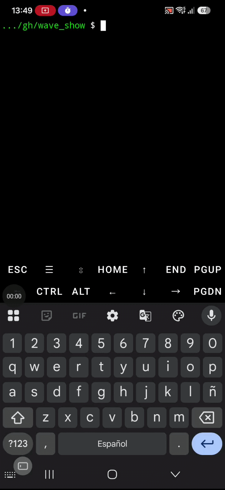

# Wave Curses 🌊

Audio waveform visualizer in terminal (curses) for MP3 and other audio formats. Displays the envelope (min/max amplitude) of audio in real-time, with an interactive cursor to navigate through the track.



[](https://www.python.org)
[](https://ffmpeg.org)
[](https://termux.com)
[](#license)

## Features

- Waveform visualization in terminal (curses)
- Envelope calculation (min/max per bin) via ffmpeg streaming
- Automatic caching to avoid recomputation (useful for long audio files)
- Left/right arrow navigation
- Show approximate time at cursor position
- Adjustable sample rate (+/-) for more/less detail
- Compatible with very long audio files (hours)

## Dependencies

- **Python 3** (3.6+)
- **ffmpeg** (includes ffprobe)
- **curses** (Python standard library, but may need separate package on some systems)

### Installation on Termux

```bash
# Update and install dependencies
pkg update
pkg install -y python ffmpeg
```

### Installation on Other Linux Distributions

```bash
# Debian/Ubuntu
sudo apt install python3 ffmpeg

# Arch Linux
sudo pacman -S python ffmpeg

# Fedora
sudo dnf install python3 ffmpeg
```

### Verification

```bash
# Verify ffmpeg and ffprobe are available
which ffmpeg ffprobe
python3 -c "import curses; print('curses OK')"
```

## Usage

```bash
python3 wave_curses.py /path/to/audio.mp3
```

Example on Termux:
```bash
python3 wave_curses.py /sdcard/Music/my_audio.mp3
```

## Controls

| Key | Action |
|-----|--------|
| `←` `→` | Move cursor |
| `Enter` | Show approximate time at current position |
| `+` / `=` | Increase sample rate (more detail, slower) |
| `-` | Decrease sample rate (less detail, faster) |
| `r` | Force recompute (deletes cache) |
| `q` | Quit |

## How It Works

1. Uses `ffprobe` to get the audio duration.
2. Decodes audio to PCM mono with `ffmpeg` in streaming mode.
3. Calculates min/max amplitude per "bin" (audio segment).
4. Draws the envelope in the terminal using curses.
5. Saves a cache `.env_*.json` file to avoid recomputing next time.

## Notes

- First execution may take a few seconds (or minutes for long audio files) while calculating the envelope.
- Subsequent executions use the cache and are almost instant.
- Default sample rate is 8000 Hz (good speed/quality balance).
- You can adjust sample rate with +/- during execution.

## Cache Example

When running on `Jardín de rosas - Rojo.mp3`, the following file is created:
`.rosas.mp3.env_8000hz_38bins.json`

## License

This project is for personal use. No guarantee of compatibility with all audio formats.